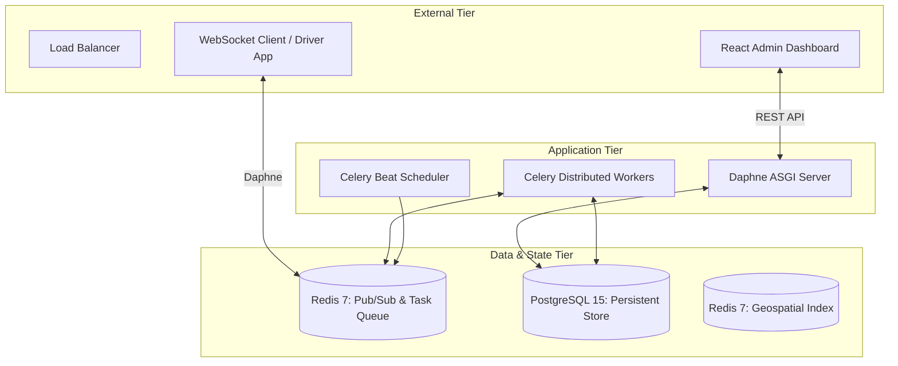

# TrackHive: Distributed Delivery Orchestration & Real-time Telemetry Engine 📦 🐝

[](https://opensource.org/licenses/MIT)
[](https://www.python.org/downloads/release/python-3110/)
[](https://www.djangoproject.com/)
[](https://redis.io/)
[](https://www.postgresql.org/)

**TrackHive** is a production-grade, event-driven orchestration platform engineered for high-throughput logistics and real-time asset tracking. Built on a distributed micro-services architecture, it manages the critical lifecycle of delivery operations—from intelligent agent assignment to sub-second telemetry synchronization and automated anomaly detection.

---

## 🏗 System Architecture

TrackHive utilizes an **asynchronous, message-driven architecture** designed for horizontal stability and low-latency data propagation.



### Architectural Breakdown
- **Asynchronous Ingestion**: Driver telemetry is ingested via WebSockets (ASGI/Daphne) and streamed directly to a Redis-backed Pub/Sub layer, bypassing traditional RDBMS bottlenecks for transient data.
- **Distributed Job Queue**: Computationally expensive operations—such as route deviation analysis and ETA recalculations—are offloaded to stateless Celery workers.
- **Geospatial Indexing**: Utilizes Redis `GEO` primitives to perform high-speed neighbor searches and proximity-based agent assignment in `$O(log(N))$` time.

---

## 🚀 Key Engineering Features

### 📡 Real-time Telemetry & State Synchronization
- **Low-Latency Updates**: Engineered with Django Channels to provide sub-second position updates to administrative dashboards.
- **Dynamic Pub/Sub**: Implements per-order and per-agent message channels to ensure precise data broadcasting without over-fetching.

### ⚠️ Intelligent Anomaly Detection System
- **Real-time Heuristics**: Automated workers monitor for "Speed Anomalies," "Stale Agents," and "Route Deviations" using rolling-window telemetry analysis.
- **Event-Driven Alerts**: Anomalies trigger immediate WebSocket broadcasts to admin consoles for zero-lag operational intervention.

### 🤖 Synthetic Load Simulator
- **High-Concurrency Testing**: A built-in simulator capable of mocking concurrent autonomous agents to stress-test the system's throttle limits and race-condition handling.

---

## 🛠 Tech Stack

| Component | Technology | Detail |
| :--- | :--- | :--- |
| **Runtime** | Python 3.11 | Optimized for performance and asynchronous I/O |
| **Framework** | Django 4.2 / DRF | Enterprise-grade ORM and RESTful architecture |
| **Real-time** | Django Channels 4 | WebSocket orchestration via Daphne ASGI |
| **Distributed Tasks** | Celery 5.3 | Asynchronous execution with Gevent concurrency |
| **Primary Database** | PostgreSQL 15 | Relational integrity for core business entities |
| **State & Cache** | Redis 7 | Multi-purpose use for Pub/Sub, Caching, and GEO hashing |
| **Containerization** | Docker / Compose | Consistent, service-oriented environment orchestration |

---

## 📊 Reliability & Performance

- **Distributed Locking**: Implements Redis-based mutex locks to prevent race conditions during order assignment, ensuring a "single-assignment" integrity model.
- **Advanced Throttling**: Multi-tier rate limiting (Anon: 20/min, User: 200/min) protects system resources from API abuse and high-frequency simulator traffic.
- **Health Monitoring**: Integrated health probes for core dependencies (DB, Redis) with automated container recovery policies.

---

## 📈 Observability & Security

- **Structured JSON Logging**: Custom-built `JsonFormatter` provides machine-readable logs compatible with ELK, Splunk, and Docker logging drivers.
- **Task Lifecycle Telemetry**: Automated logging of every background task, including execution duration (ms) and final state (SUCCESS/FAILURE).
- **JWT Authentication**: Stateless, secure communication across all API endpoints with configurable token lifetimes.

---

## 🧪 Testing & Validation

TrackHive maintains a high-quality codebase through a comprehensive `pytest` suite:
```bash
# Execute full backend test suite
docker-compose exec web pytest tests/test_trackhive.py -v
```
**Coverage Includes**:
- Distributed Mutex Integrity
- Real-time Anomaly Trigger Logic
- Rate-Limit Enforcement
- Geospatial Search Precision

---

## 🚀 Deployment

The system is fully containerized for simplified deployment and environment parity.

```bash
# Spin up the project cluster
docker-compose up --build -d
```

**Cluster Includes**:
1. `web`: ASGI Application Server
2. `db`: PostgreSQL Persistent Layer
3. `redis`: Unified Cache/Broker/Geo-Store
4. `celery`: Async Anomaly Detection Engine
5. `celery-beat`: Periodic Task Scheduler

---

## 📄 License
Distributed under the **MIT License**. See `LICENSE` for details.

---
**Architected by**: [Flamekaiser17](https://github.com/Flamekaiser17)
